# 交通分布
武汉市位于江汉汇流处，水运便利，明清时期就有“九省通衢”的美称。近代京汉铁路和粤汉铁路等铁路的陆续建成，以及后续的国道、高速公路、高铁（含动车组）、机场的建设，使武汉成为中国最重要的水陆空综合交通枢纽之一。

# 航空
作为华中地区航空中心，武汉先后曾有过三个客运机场：南湖机场、王家墩机场、天河国际机场。在南湖机场迁往天河国际机场后，武汉也曾出现一座城市两个客运机场同时使用的情况。其后因武汉市城市开发的需要和航空业务的发展，原在王家墩机场运营的武汉航空公司也迁往武汉天河国际机场。

武汉天河国际机场位于武汉市北部，坐落在武汉市黄陂区天河镇境。武汉天河机场距离市区大约有16公里，由武汉机场高速公路相连。机场每天都有直达北京、上海、南京、郑州、广州、南昌、福州、成都等国内主要城市的航班及部分国际航班，是国家公共航空运输体系确定的全国八大区域性枢纽机场之一。

地址：武汉市黄陂区天河机场路

电话：027-96577

官方网址：[http://www.whairport.com/](http://www.whairport.com/)

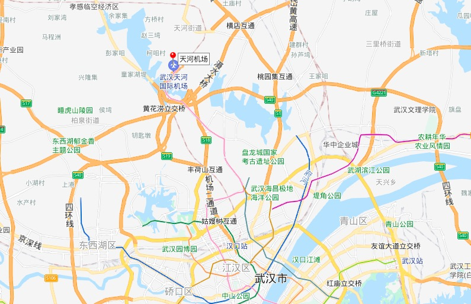

# 铁路
武汉是中国最为重要的铁路枢纽之一，位于京广铁路、汉丹铁路、长荆铁路、武九铁路、武麻铁路交汇处。京广铁路穿城而过，京九铁路从市东北角的新洲区穿过，另有武广铁路客运专线和合武快速铁路。武昌火车站、汉口火车站和武汉火车站构成了武汉客运枢纽。武昌南编组站、市北郊已建成的“亚洲最大编组站”武汉北编组站构成了武汉货运枢纽。有中国18个铁路局（集团）之一的武汉铁路局。 
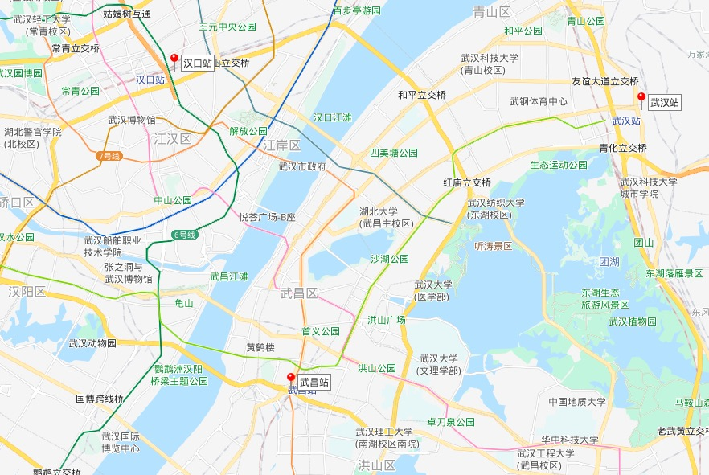

## 汉口站
汉口站位于中国湖北省武汉市江汉区金家墩，毗邻二环线，是宁蓉铁路、汉丹铁路和武孝城际等线路的客运枢纽站，是国内最大的欧式火车站。

地址：武汉市江汉区发展大道

交通：地铁2号线，汉口站下车。乘坐9、292路公交车可达。

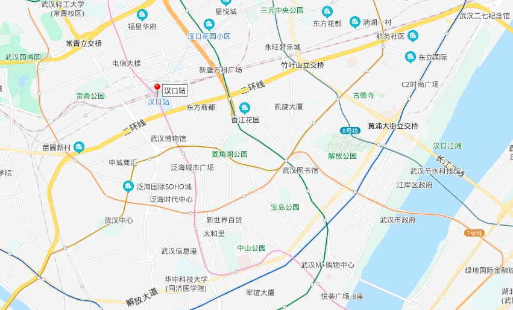

## 武昌站
武昌站位于湖北省武汉市武昌区，始建于1916年，先后称通湘门站、宾阳门站、武昌总站、武昌南站，1957年迁到现地址，2007年建成现站房。武汉目前客运量最大的站。

地址：武汉市武昌区中山路

交通：地铁2号线或66、540等路公交车可达。

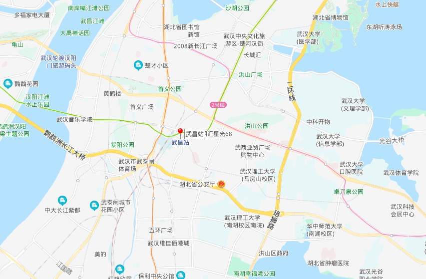

## 武汉站
武汉站位于湖北省武汉市洪山区，紧邻青山区与洪山区交界的杨春湖南侧，毗邻三环线，是京广高速铁路中途枢纽车站，亦通过滠武铁路联通武九客运专线、武九铁路和京广铁路，已于2009年12月26日随武广高铁的开通启用。主要营运高铁和动车，距离市区较远。

地址：武汉市青山区与洪山区交界的杨春湖南侧

交通：地铁4号线或118、513路公交车可达。

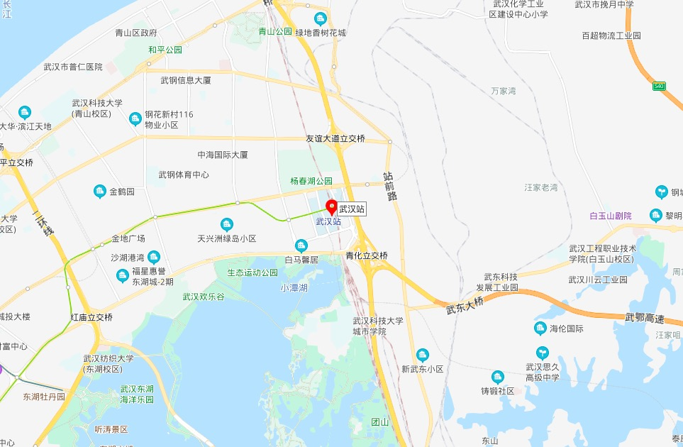

# 长途汽车
武汉有开往北京、上海、南京、合肥、长沙、郑州等大中城市的长途汽车，也有开往三峡、张家界、黄山、井冈山等著名旅游地的班车，省内各大旅游景点也有班车可达。

武汉三镇拥有汉口新荣长途汽车客运站、金家墩长途汽车客运站、武昌傅家坡长途汽车客运站、宏基长途客运站、杨春湖客运换乘中心等5个国家一级客运站，古田客运站、汉口北客运站等2个二级客运站。

# 轨道交通
从2000年武汉第一条轨道交通线路开建以来，到目前，武汉轨道交通已实现“从无到有、从单条线到网络化”的历史转变。现已建成运营轨道交通1号线、2号线一期、机场线、2号线南延线、4号线、3号线、6号线、7号线、8号线一期、8号线三期、阳逻线、11号线东段（光谷火车站－左岭）、纸坊线、蔡甸线，总运营里程达339公里，车站总数达228座。按照国家发展改革委的第四期建设规划批复，至 2024 年，还将建成12号线等项目，形成 14 条线路运营、总长 606 公里的轨道网，全面实现“主城连网、新城通线”。

官方网址：https://www.wuhanrt.com/

## 营运中
### 1 号线
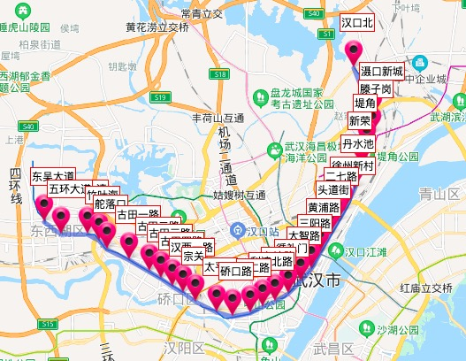

全程33站：
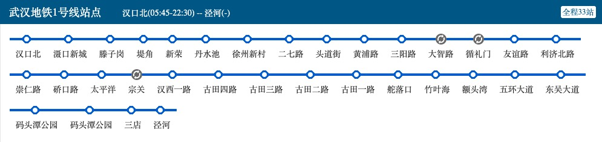

### 2号线
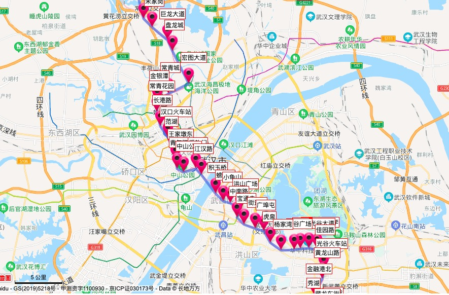

全程38站：
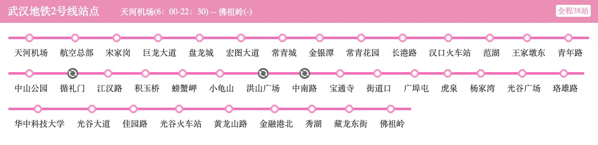

### 3号线
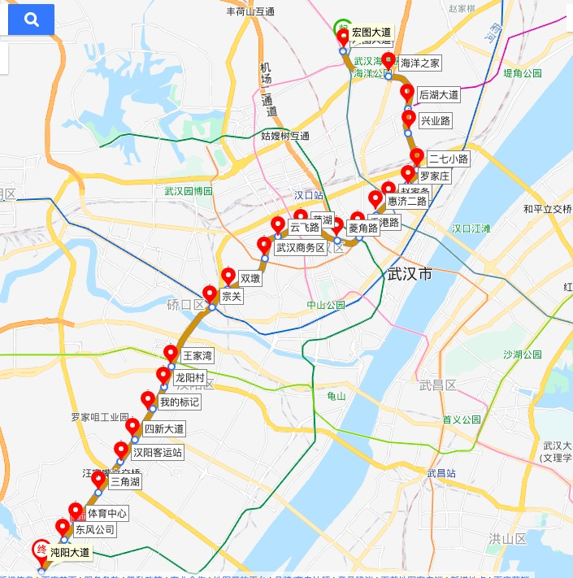

全程24站：
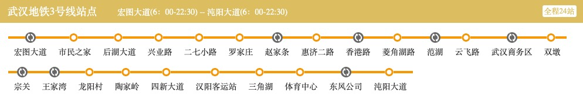

### 4号线
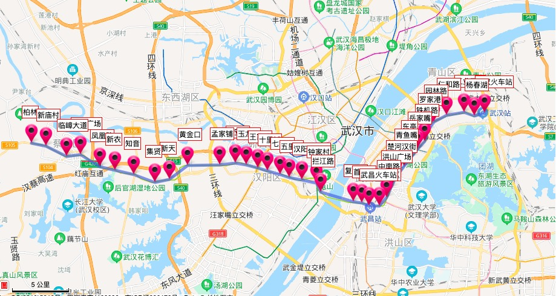

全程37站：
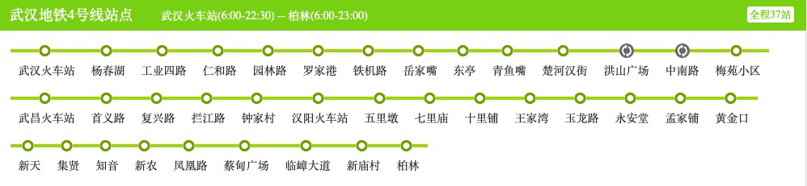

### 6号线
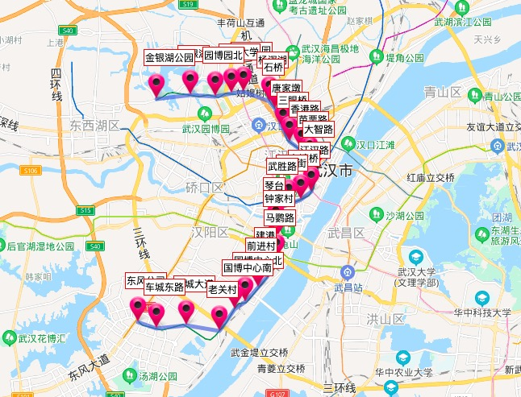

全程27站：
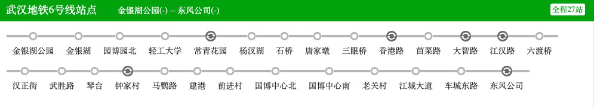

### 7号线
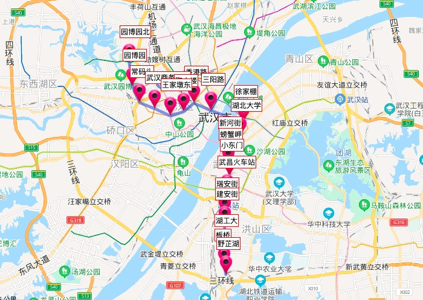

全程19站：
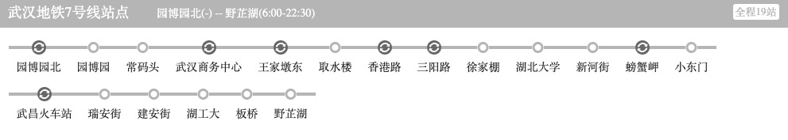

### 8号线
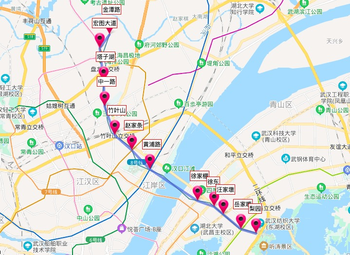

全程12站： 

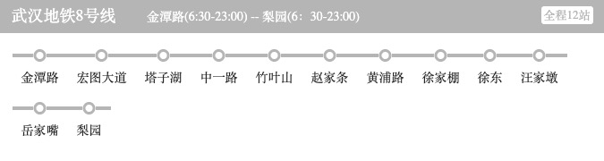

### 阳逻线
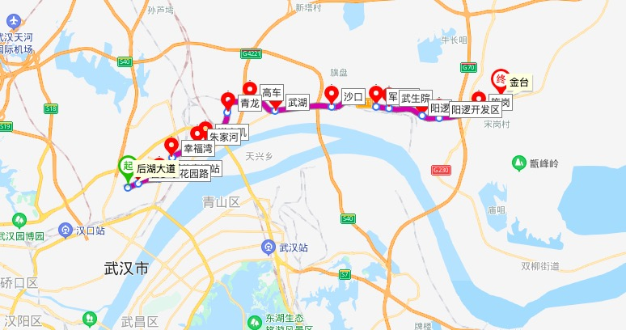

又称21号线，全程16站：
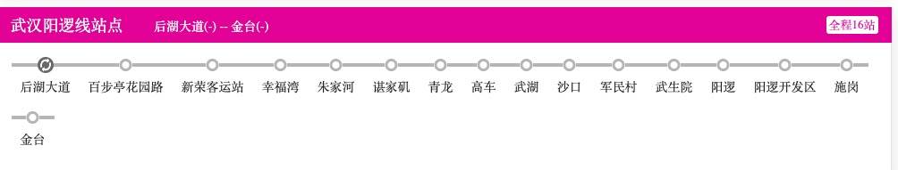

### 11号线东段
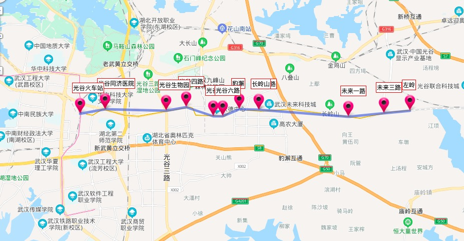

全程13站：
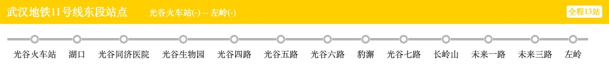

## 在建线路
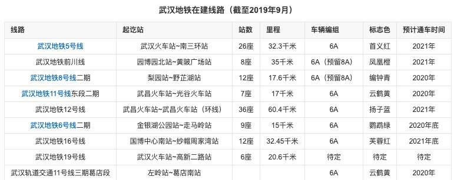

## 拟建线路
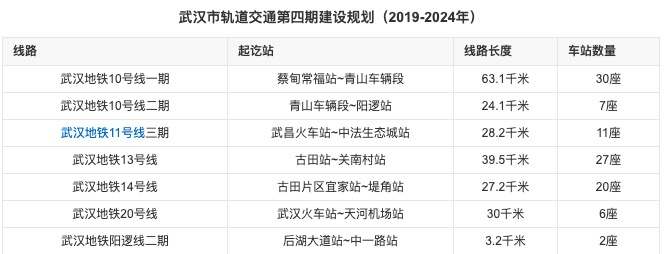

## 总体规划
依据武汉市城市总体规划和综合交通规划，武汉市城市轨道交通线网由25条线路组成，总长约1045千米，设车站603座，其中换乘车站123座。规划2020年，武汉市区公共交通占机动化出行量比例达到62.5%，轨道交通占公共交通的比例达到53%。

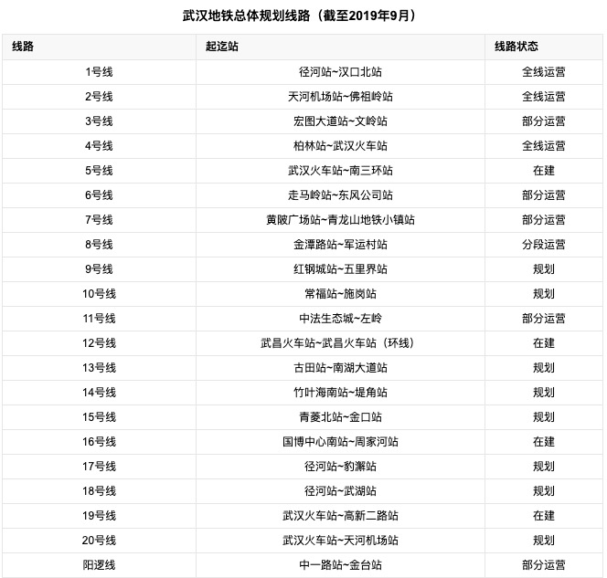

参考:

[武汉交通](https://zh.wikipedia.org/wiki/武汉交通)

[武汉地铁](https://baike.baidu.com/item/武汉地铁/854799)

[汉口站](https://zh.wikipedia.org/wiki/汉口站)

[武昌站](https://zh.wikipedia.org/wiki/武昌站)

[武汉站](https://zh.wikipedia.org/wiki/武汉站)

[交通指南](https://gs.ctrip.com/html5/you/traffic/145.html)

[武汉本地宝](http://wh.bendibao.com/ditie/linemap.shtml)