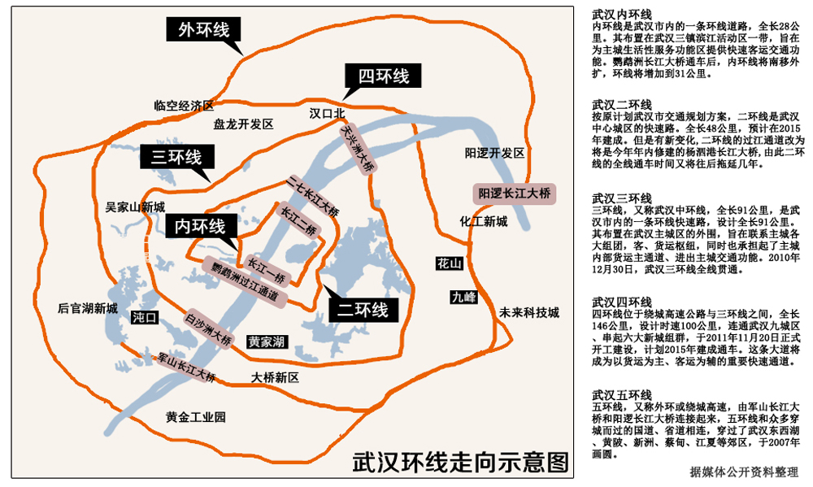
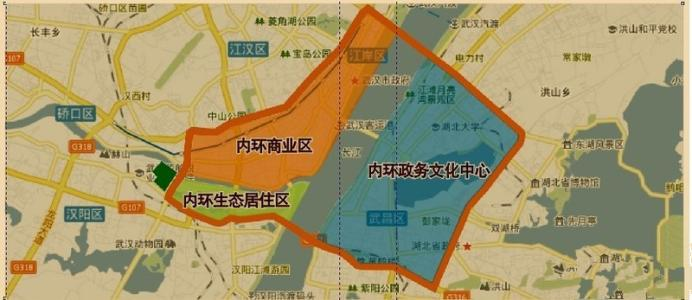
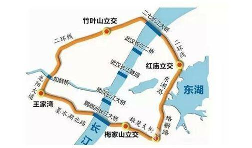
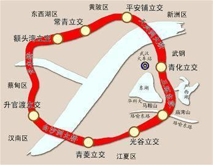
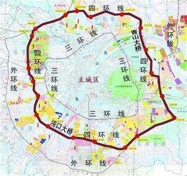
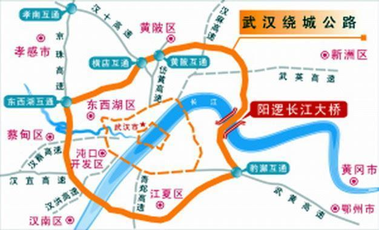

# 武汉环线
“紧走慢走，走不出汉口”，是说武汉之大，其实也是说当初交通的不便。如今的武汉，已拥有五环，形成了环环相扣的交通格局。莫说是外地人，就是武汉人其实也不完全知道这五环到底在哪里？

## 一环线
也称内环线。1995年5月底，长江二桥建成通车后，武汉第一条城市环线——长28公里的内环线形成。内环线经过几轮调整，目前的具体走向为：汉口：黄浦大街——解放大道——武胜路——江汉桥——汉阳：鹦鹉大道——龟山南路——武汉长江大桥——武昌：彭刘杨路——阅马场——武珞路——中南路——中北路——徐东大街——长江二桥——汉口：黄浦大街。

## 二环线
2015年武汉二环线全线贯通。二环线全长48公里，由二七长江大桥、二七路，发展大道，汉西路，汉水二桥(知音桥)，龙阳大道、墨水湖北路、鹦鹉洲长江大桥、雄楚大街、珞狮北路、水果湖隧道、东湖路等围合而成。

## 三环线
又称武汉中环线。2010年12月30日，三环线全线贯通。全长91公里，由武汉白沙洲长江大桥和武汉天兴洲长江大桥合围而成。三环犹如系在江城腰间的一条“金腰带”，内拥武汉7个中心城区，外连6个远城区，挽起光谷、沌口、吴家山经济技术开发区三大国家级开发区，衔接武汉所有进、出口道路。

## 四环线
武汉四环线是连接六大新城组群的快速通道，位于绕城高速公路与三环线之间，全长146公里，双向8车道，设计时速100公里。四环线西段作为最先开工建设的一段，起于沌口徐家堡立交，与汉洪高速对接，止于东西湖慈惠立交，与107国道相接，途中通过新天铺立交与汉蔡高速相交，沿线经过东西湖区、蔡甸区、汉阳区和武汉经济技术开发区，全长22.5公里，已于去年通车。四环线南段起于龚家铺，接沌口公路大桥，跨青郑高速、107国道、江夏大道，止于中洲，总里程17公里，预计2017年底通车。四环线北段东起黄陂区武湖农场农科所北侧，对接青山长江公路大桥北岸接线，自东向西延伸，止于东西湖区十一支沟107国道。四环线东段与已建成的武汉绕城高速公路一段并线，全长31.196公里，今年启动改扩建的并线段为武汉绕城高速公路中洲至北湖段，呈南北走向，起于南四环藏龙岛枢纽互通，经凤凰山、豹澥、九龙、花山，止于东四环北湖枢纽互通。因东四环线此前部分与武汉外绕城高速同线，预计线路将重新规划设计。

## 五环线
武汉绕城高速公路亦称“武汉外环线”，2007年12月建成，国家高速公路网编号G4201，规划长度188公里，由西南段(京珠高速)、东北环(东西湖红羽村——江夏豹澥镇)及阳逻长江公路大桥组成，连通东西湖、黄陂、新洲、洪山、江夏、蔡甸等6个区，串连武汉开发区、东西湖吴家山、东湖高新、阳逻、庙山等开发区，双向四车道，设计时速120公里。包括阳逻长江大桥和军山长江大桥两座跨越长江的桥梁，已全部投入运营。

参考:
[武汉本地宝](http://wh.bendibao.com/traffic/2018129/90878.shtm)